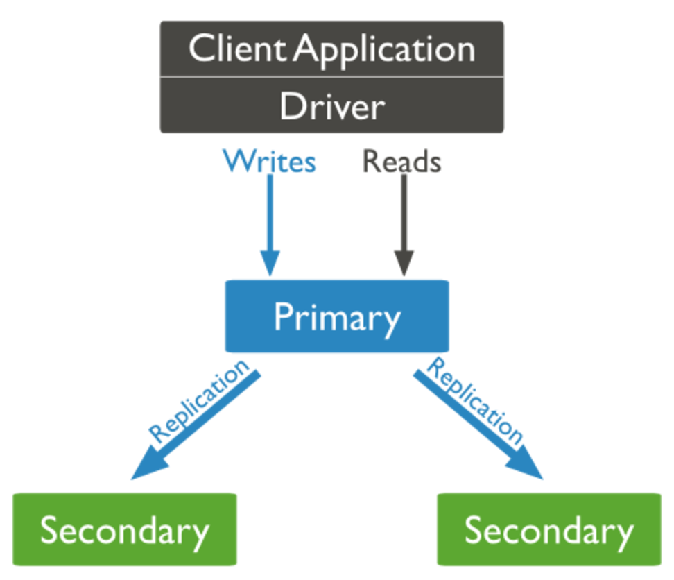

# mongodb高可用实战
本文从概念篇和实战篇详细介绍mongodb高可用相关内容。概念篇介绍mongodb相关高可用方案，重点讲解mongodb副本集，实战篇则以实际项目为例手把手实现一个mongodb高可用集群。
## 概念篇
### mongodb基础介绍

MongoDB（来自于英文单词“Humongous”，中文含义为“庞大”）是基于文档类型的开源数据库。作为一个适用于敏捷开发的数据库，MongoDB的数据模式可以随着应用程序的发展而灵活地更新。与此同时，它也为开发人员 提供了传统数据库的功能：二级索引，完整的查询系统以及严格一致性等等。 

MongoDB具有可扩展，高性能和高可用等特点。它可以从单服务器部署扩展到大型、复杂的多数据中心架构。利用内存计算的优势，MongoDB能够提供高性能的数据读写操作。 MongoDB的本地复制和自动故障转移功能使产品具有企业级的可靠性和操作灵活性。
### mongodb高可用方案

#### 主从
#### 副本集

副本集是一组服务器，其中有一个主服务器，用于处理客户端请求，还有多个备份服务器，用于保存主服务器的数据副本。如果主服务器崩溃了，备份服务器会自动将其中一个成员升级为新的主服务器。如果有一台服务器宕机了，仍然可以从副本集的其他服务器上访问数据，如果服务器上的数据损坏或者不可访问，可以从副本集的某个成员中创建一份新的数据副本。
## 实战篇

